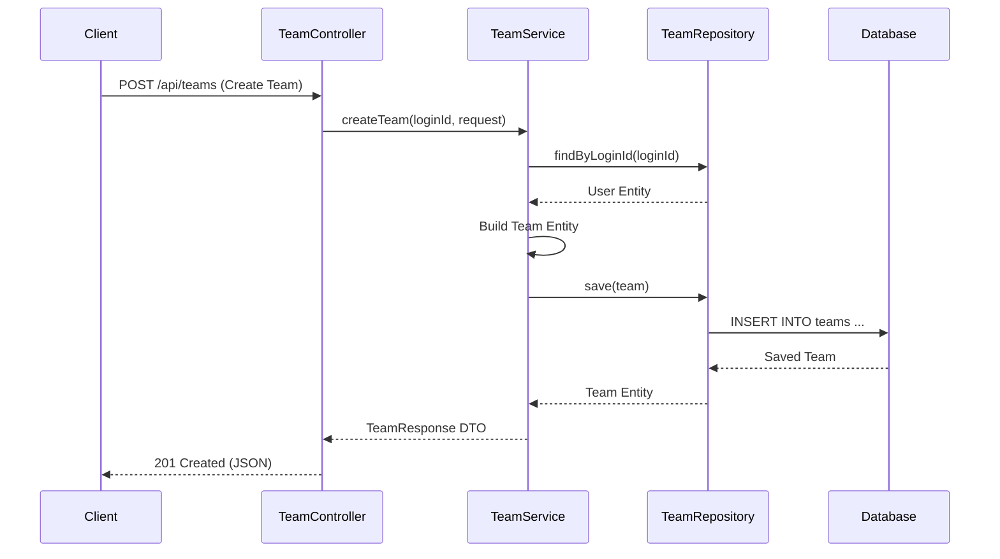

# Spring Boot Deep Dive: Co-Work Project Technical Documentation

이 문서는 'Co-Work' 프로젝트에 적용된 Spring Boot의 핵심 기술과 그 구현 원리를 심층적으로 설명합니다. 단순한 기능 명세가 아닌, **기술적 의사결정의 배경(Why)**과 **Spring 프레임워크의 내부 동작 원리(How)**를 중심으로 작성되었습니다.

---

## 1. 프로젝트 아키텍처 (Layered Architecture)

### 개념: 관심사의 분리 (Separation of Concerns)
본 프로젝트는 유지보수성과 확장성을 위해 **Layered Architecture**를 채택했습니다. 각 계층은 고유한 책임을 가지며, 상위 계층은 하위 계층에만 의존합니다.

- **Presentation Layer (`Controller`):** 클라이언트의 요청(HTTP)을 받아 검증하고, 비즈니스 로직으로 전달하며, 결과를 응답(JSON)으로 변환합니다.
- **Business Layer (`Service`):** 핵심 비즈니스 로직을 수행하고, 트랜잭션을 관리합니다.
- **Data Access Layer (`Repository`):** 데이터베이스와의 통신을 담당합니다.

### 적용 사례: Team 도메인
`TeamController`에서 `TeamService`를 거쳐 `TeamRepository`로 이어지는 단방향 흐름을 구축했습니다.

- **Controller:** `@com/cowork/domain/team/controller/TeamController.java`
- **Service:** `@com/cowork/domain/team/service/TeamService.java`
- **Repository:** `@com/cowork/domain/team/repository/TeamRepository.java`

이러한 구조 덕분에 비즈니스 로직이 변경되더라도 API 명세(Controller)나 데이터 접근 기술(Repository)에 영향을 최소화할 수 있습니다.

### Request Flow Diagram (Mermaid)



---

## 2. Spring의 핵심: IoC와 DI (제어의 역전 & 의존성 주입)

### 개념: 객체 관리의 주체 변화
기존 Java 프로그래밍에서는 개발자가 직접 `new TeamService()`와 같이 객체를 생성하고 관리했습니다. 하지만 Spring에서는 **IoC (Inversion of Control)** 개념을 통해 객체(Bean)의 생명주기 관리를 **Spring Container**에게 위임합니다.

이를 구현하는 핵심 패턴이 **DI (Dependency Injection)**입니다. 객체가 필요한 의존성을 스스로 찾지 않고, 컨테이너가 주입해주는 방식입니다.

### 적용 사례: 생성자 주입 (Constructor Injection)
우리 프로젝트는 가장 권장되는 방식인 **생성자 주입**을 사용합니다. 이는 Lombok의 `@RequiredArgsConstructor`와 함께 사용하여 보일러플레이트 코드를 최소화했습니다.

**예시: `TeamService.java`**
```java
@Service
@RequiredArgsConstructor // final 필드에 대한 생성자 자동 생성
public class TeamService {

    // Spring Container가 알아서 주입 (Autowired 불필요)
    private final TeamRepository teamRepository;
    private final TeamMemberRepository teamMemberRepository;
    private final UserRepository userRepository;
    
    // ...
}
```

**왜 이 방식을 선택했는가?**
1.  **불변성(Immutability):** `final` 키워드를 사용하여 의존성 객체가 변경되지 않음을 보장합니다.
2.  **테스트 용이성:** 순수 자바 코드로 단위 테스트를 작성할 때, 생성자를 통해 Mock 객체를 쉽게 주입할 수 있습니다.
3.  **순환 참조 방지:** 애플리케이션 구동 시점에 순환 참조 오류를 즉시 발견할 수 있습니다.

---

## 3. Spring Security와 JWT (Stateless Architecture)

### 개념: Stateful vs Stateless
전통적인 세션(Session) 방식은 서버 메모리에 사용자 상태를 저장하는 **Stateful** 구조입니다. 이는 트래픽이 몰려 서버를 확장(Scale-out)할 때 세션 동기화 문제를 야기합니다.
반면, 우리는 **JWT (Json Web Token)**를 사용한 **Stateless** 아키텍처를 구현했습니다. 서버는 상태를 저장하지 않고, 클라이언트가 보낸 토큰만 검증하면 되므로 확장성이 뛰어납니다.

### 적용 사례: SecurityFilterChain과 JwtFilter

`SecurityConfig`에서 Spring Security의 표준 필터 체인에 커스텀 필터인 `JwtFilter`를 끼워 넣었습니다.

**1. FilterChain 구조 (`SecurityConfig.java`)**
```java
// JWT Filter를 UsernamePasswordAuthenticationFilter 앞에 배치
http.addFilterBefore(new JwtFilter(jwtUtil), UsernamePasswordAuthenticationFilter.class);
```
이렇게 함으로써 Spring Security가 기본 인증 처리를 하기 전에, 우리가 만든 필터가 먼저 토큰을 검사하여 인증 정보를 SecurityContext에 심어줍니다.

**2. 문지기 역할 (`JwtFilter.java`)**
`JwtFilter`는 `DispatcherServlet`에 요청이 도달하기 전에 작동합니다.
- 요청 헤더에서 `Authorization: Bearer <token>` 추출
- 토큰 유효성 검증 (`jwtUtil.validateToken`)
- 검증 성공 시 `SecurityContextHolder`에 인증 객체(`Authentication`) 저장

이 과정을 통과해야만 Controller의 로직이 실행될 수 있으므로, 보안성이 철저하게 보장됩니다.

---

## 4. JPA와 ORM의 깊은 이해 (Entity vs DTO)

### 문제: 순환 참조 (Infinite Recursion)
개발 초기, Entity를 그대로 Controller에서 반환했을 때 `StackOverflowError`가 발생했습니다.
이는 양방향 연관관계(예: Team <-> TeamMember)를 가진 객체를 Jackson 라이브러리가 JSON으로 직렬화할 때, 서로를 끊임없이 참조하기 때문에 발생합니다.

### 해결책: DTO (Data Transfer Object) 변환 패턴
`@JsonIgnore`를 사용하는 임시방편 대신, 우리는 응답 전용 DTO를 만들어 해결했습니다. 이는 **OSIV (Open Session In View)** 설정과 무관하게 엔티티를 프레젠테이션 계층에 노출시키지 않는다는 점에서도 중요한 설계 원칙입니다.

**예시: `TeamDetailResponse.java`**
```java
public static TeamDetailResponse of(Team team, List<TeamMemberResponse> members) {
    return TeamDetailResponse.builder()
            .id(team.getId()) // 필요한 필드만 선택적으로 매핑
            .name(team.getName())
            .members(members) // 연관된 리스트도 DTO로 변환하여 주입
            .build();
}
```
이렇게 함으로써 API 응답 스펙을 엔티티 구조와 분리하여 독립적으로 관리할 수 있게 되었습니다.

### 영속성 컨텍스트: Dirty Checking (변경 감지)
`TaskService`의 `updateTask` 메서드에는 별도의 `update` 쿼리를 날리는 로직이 없습니다. 대신 엔티티의 필드만 수정합니다.

```java
task.updateTask(...); // 객체의 상태만 변경
// 트랜잭션 종료 시점에 JPA가 스냅샷과 비교하여 변경사항을 감지하고 UPDATE 쿼리 자동 실행
```
이를 **Dirty Checking**이라고 하며, 객체 지향적으로 데이터를 다룰 수 있게 해주는 JPA의 핵심 기능입니다.

### 동시성 제어: 낙관적 락 (Optimistic Lock)
여러 사용자가 동시에 같은 Task를 수정할 때 데이터 정합성을 보장하기 위해 `@Version`을 활용한 낙관적 락을 적용했습니다.

**`TaskService.java`**
```java
if (request.getVersion() != null && !request.getVersion().equals(task.getVersion())) {
    throw new CustomException(ErrorCode.TASK_VERSION_CONFLICT);
}
// ...
try {
    taskRepository.save(task);
} catch (ObjectOptimisticLockingFailureException e) {
    throw new CustomException(ErrorCode.TASK_VERSION_CONFLICT);
}
```
DB 레벨의 락(Pessimistic Lock)을 걸지 않고, 버전 번호를 비교하여 충돌을 감지함으로써 성능 저하 없이 동시성 문제를 해결했습니다.

---

## 5. AOP와 트랜잭션 관리

### 개념: 관점 지향 프로그래밍 (Aspect Oriented Programming)
로깅, 트랜잭션, 예외 처리 등 애플리케이션 전반에 걸쳐 공통적으로 필요한 기능(횡단 관심사)을 핵심 비즈니스 로직에서 분리하는 기술입니다.

### 적용 사례 1: @Transactional (Proxy Pattern)
서비스 메서드에 `@Transactional`을 붙이면, Spring은 프록시 객체를 생성하여 코드를 감쌉니다.

1. `TransactionManager`가 트랜잭션 시작 (`UserTransaction.begin()`)
2. 실제 서비스 메서드 실행 (`target.method()`)
3. 성공 시 커밋(`commit`), 예외 발생 시 롤백(`rollback`)

개발자는 복잡한 `try-catch-rollback` 코드 없이 비즈니스 로직에만 집중할 수 있습니다.

### 적용 사례 2: @RestControllerAdvice (Global Exception Handling)
컨트롤러 곳곳에 흩어질 수 있는 `try-catch` 문을 제거하기 위해 AOP 기반의 전역 예외 처리기를 구현했습니다.

**`GlobalExceptionHandler.java`**
```java
@RestControllerAdvice
public class GlobalExceptionHandler {
    
    @ExceptionHandler(CustomException.class) // CustomException이 발생하면 이 메서드가 가로챔
    public ResponseEntity<ApiResponse<Void>> handleCustomException(CustomException e) {
        // 표준화된 에러 응답 포맷으로 변환 반환
        return ResponseEntity.status(e.getErrorCode().getStatus())
                             .body(ApiResponse.error(e.getMessage()));
    }
}
```
이로 인해 일관된 에러 응답 포맷을 유지하고, 에러 처리 로직을 한 곳에서 중앙 집중적으로 관리할 수 있습니다.

---

## 6. 결론: Spring Boot가 주는 이점

이 프로젝트를 통해 Spring Boot가 단순한 프레임워크가 아니라, **생산성과 안정성을 동시에 잡을 수 있는 플랫폼**임을 확인했습니다.

1.  **내장 톰캣 (Embedded Tomcat):** 별도의 WAS 설치 없이 `main()` 메서드 실행만으로 웹 서버를 띄울 수 있어 배포와 테스트가 비약적으로 간소화되었습니다.
2.  **자동 설정 (Auto Configuration):** `spring-boot-starter-web`, `spring-boot-starter-data-jpa` 등의 의존성만 추가하면, 복잡한 설정 파일 없이도 DB 연결, JSON 컨버터 등이 자동으로 구성되었습니다.
3.  **생태계 통합:** Security, Validation, Swagger 등 다양한 라이브러리들이 Spring 생태계 안에서 유기적으로 결합되어, 우리는 비즈니스 로직 구현이라는 본질적인 가치에 집중할 수 있었습니다.
